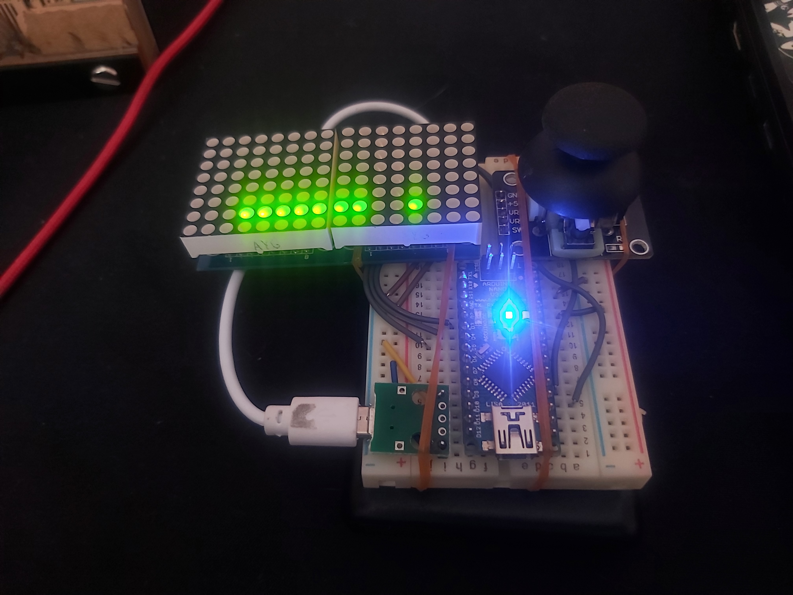

# Snake game on led matrix

   

Video demo:  
https://youtu.be/YKGNB3k2D20  

Based on https://github.com/ondt/arduino-snake  

Snake game on 8x16 led matrix  
Analog joystick control  
Score indication  
Snake start to move itself if leaved untouched for some time  

## Making of
Testing:  
https://youtu.be/pQAVfXpTf9I  

